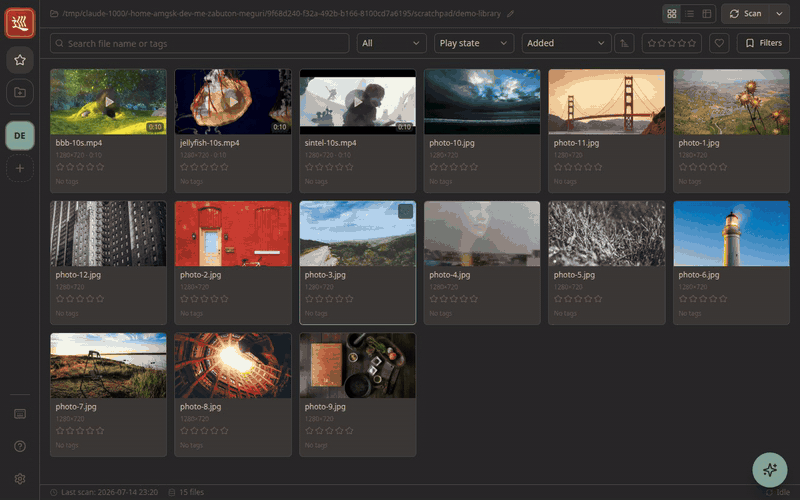
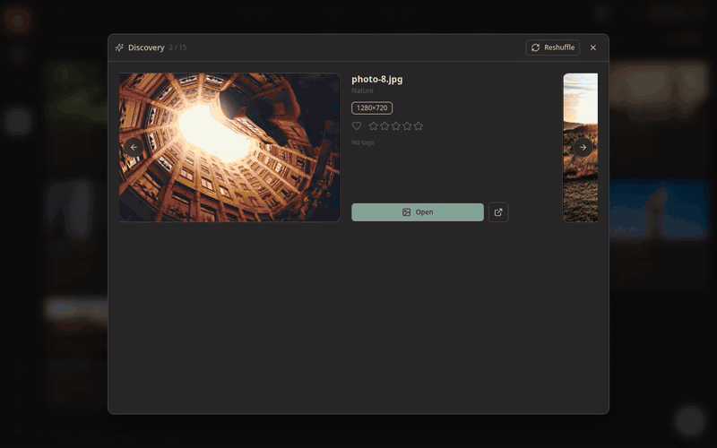
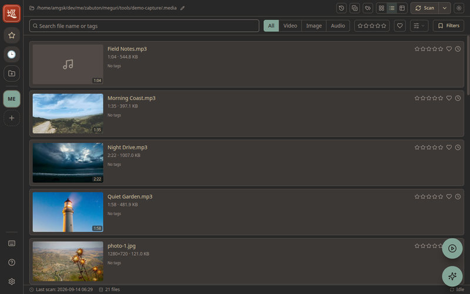
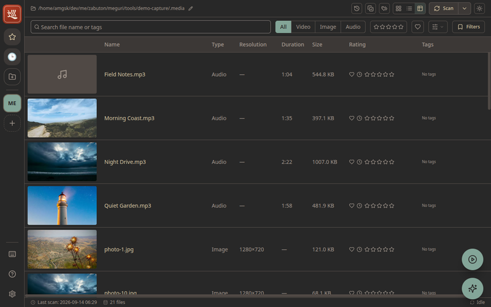
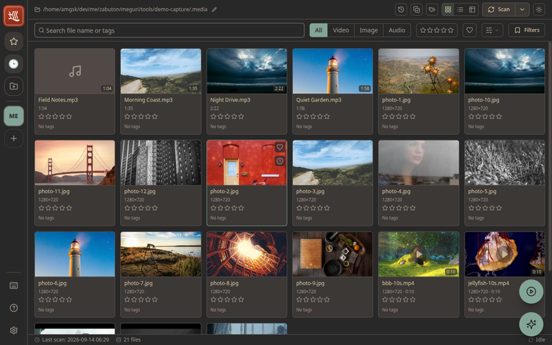
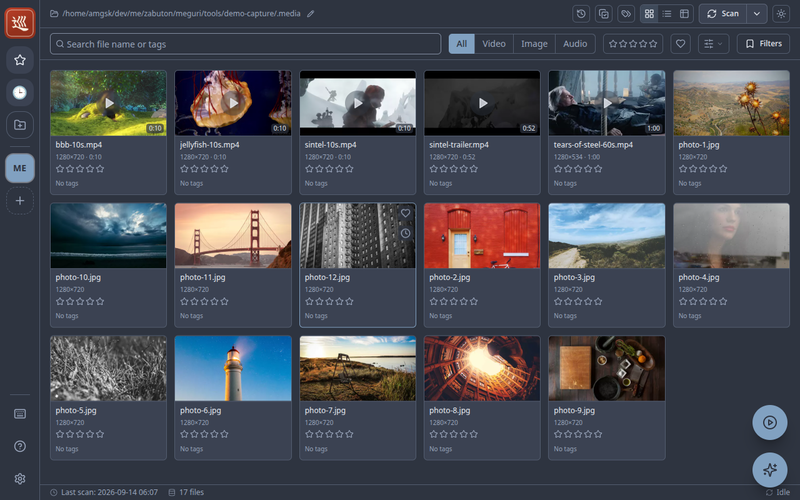
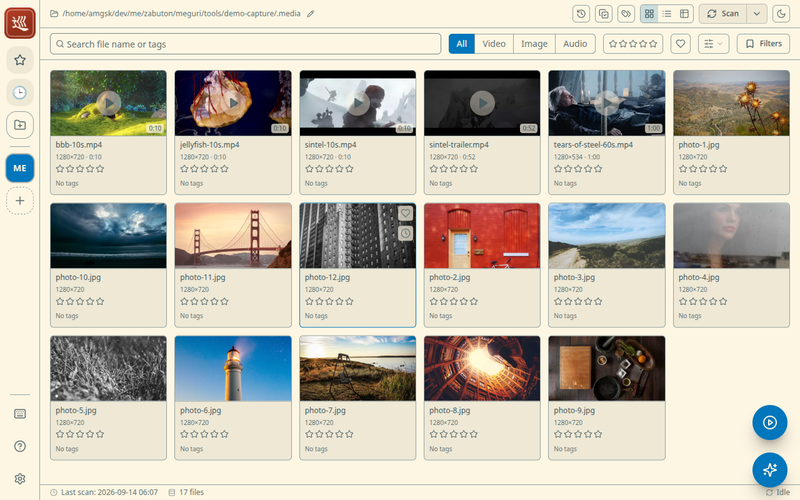

<div align="center">


# Meguri

**A local-first media library for your videos and photos — scan, browse,
search, and play, all offline.**

[](https://github.com/zabuton-app/meguri/actions/workflows/test.yml)
[](https://github.com/zabuton-app/meguri/actions/workflows/build.yml)
[](https://github.com/zabuton-app/meguri/releases)
[](./LICENSE)


</div>

Meguri is a personal desktop app for browsing, searching, and playing local
videos and images with thumbnails. It recursively scans any folder you point it at,
generates thumbnails, tags, and metadata, and lets you browse the collection in
a native window.

Built with **Electron + Node/TypeScript + React**. Chromium is bundled, so video
playback and rendering are largely insulated from the host environment. The only
native dependency is SQLite (better-sqlite3); ffmpeg/ffprobe ship as static
binaries, so no system-side ffmpeg is required.



## Download

Prebuilt packages are available on
[GitHub Releases](https://github.com/zabuton-app/meguri/releases).

| Platform | Packages                          |
| -------- | --------------------------------- |
| Linux    | AppImage / deb                    |
| Windows  | Installer (NSIS) / portable       |
| macOS    | dmg / zip (Apple silicon)         |

### Arch Linux (AUR)

[meguri-bin](https://aur.archlinux.org/packages/meguri-bin) is available on
the AUR. Install it with your favorite AUR helper:

```bash
yay -S meguri-bin
# or: paru -S meguri-bin
```

Or build it manually:

```bash
git clone https://aur.archlinux.org/meguri-bin.git
cd meguri-bin
makepkg -si
```

Or run from source — see [Setup and Launch](#setup-and-launch).

## Features

- 🗂️ **Workspaces** — manage multiple media directories with a Slack-style
  sidebar to add, switch, and remove them; each root gets its own database and
  thumbnails
- ⚡ **Fast, incremental scanning** — recursive walks with mtime/size checks
  and move/rename tracking via content hashes
- 🖼️ **Automatic thumbnails** — WebP thumbnails for both images and videos,
  generated by the bundled ffmpeg
- 🎬 **Smooth playback** — Range-enabled streaming from a local HTTP server;
  non-faststart containers are remuxed to fragmented MP4 on the fly (time seek
  via `?t`), and unplayable codecs are handed off to the OS default player
- 🔍 **Powerful search** — filter and sort by full text (FTS5), tags, kind,
  rating, and capture date/time, with conditions shown as removable badges
- 🏷️ **Tags, ratings & history** — manual tags with autocomplete, ★ ratings,
  and playback history that survive file moves and renames
- 🔭 **Discovery** — a shuffle mode that resurfaces random picks from your
  library with scene previews ([see below](#-discovery--find-something-new))
- 🎨 **Themes** — base16-based multi-theme switching (gruvbox / solarized /
  monokai / nord / dracula, etc.)
- 🔎 **Content zoom** — Ctrl + wheel (and Ctrl +/-/0)

## 🔭 Discovery — find something new

**Stumble upon what you forgot you had.** The bigger a library grows, the more
of it sinks out of sight. Discovery deals you a random hand from your library —
videos come with at-a-glance scene previews — so every visit surfaces something
worth rediscovering. One click reshuffles the deck; one more starts playback.



## Screenshots

Grid, list, and table layouts for browsing:

| List view                                 | Table view                                  |
| ----------------------------------------- | ------------------------------------------- |
|  |  |

Every corner of the UI follows your base16 theme:

| gruvbox dark                                          | nord dark                                       | solarized light                                             |
| ----------------------------------------------------- | ----------------------------------------------- | ----------------------------------------------------------- |
|  |  |  |

## Requirements

- Node.js 20+ / npm
- Build time only: a C/C++ toolchain (for the native build of better-sqlite3)

No runtime system dependencies are required (Chromium, ffmpeg, and SQLite are
bundled).

## Setup and Launch

### Install dependencies

```bash
npm install
```

`postinstall` rebuilds better-sqlite3 for Electron.

### Development mode

```bash
npm run dev
```

Directories can be added from within the app (the "+" in the left sidebar). If
you launch without any directory added, a screen prompting you to add one is
shown. To provide an initial directory at startup, specify it via an environment
variable (once added, it is persisted to settings thereafter).

```bash
MEGURI_ROOT=/path/to/media npm run dev
```

### Docker development mode

```bash
docker compose up --build dev
```

The Docker dev container seeds its initial workspace list from
`samples/config.json` into the persisted app data volume on first run. To reset a
local Docker workspace back to the sample state, remove the Docker volume or run
the seed step with `MEGURI_SEED_SAMPLE_CONFIG=force`.

### Build / distribution packages

```bash
npm run build      # build main / preload / renderer
npm run dist       # generate AppImage / deb (electron-builder)
```

### Type checking

```bash
npm run typecheck
```

### Testing

Unit tests (Vitest: main/core + renderer):

```bash
npm test
```

E2E tests (Playwright + Electron). Builds the app first, then launches the
packaged main process against fixture media in `e2e/fixtures/media/`:

```bash
npm run test:e2e
```

On a headless Linux environment (CI, or no display), run under a virtual
framebuffer:

```bash
xvfb-run --auto-servernum -- npx playwright test
```

CI installs Playwright browser dependencies with `npm run test:e2e:install`
(Ubuntu/Debian only). On other distros (e.g. Arch), skip `--with-deps` if you
already run Electron apps locally.

## Basic Usage

| Action     | How                                                                                                                |
| ---------- | ------------------------------------------------------------------------------------------------------------------ |
| Scan       | Runs automatically at startup. Re-scan via the header "Scan" (incremental, move tracking)                          |
| Play       | Click a thumbnail → play in the detail view. When unsupported, use "Open externally"                               |
| Tag / Rate | Assign in the detail view (tags have autocomplete). Click a tag in the grid to search                              |
| Search     | Filter and sort by full text, kind, and rating in the top bar (conditions shown as badges, individually removable) |
| Theme      | Switch from Theme at the top-right of the header                                                                   |
| Zoom       | Ctrl + wheel, Ctrl +/-, Ctrl + 0 to reset                                                                          |

## Where Data Is Stored

Scan root paths are hashed for identification and managed centrally under
Electron's userData.

```text
<userData>/                 # e.g. ~/.config/Meguri
├─ config.json              # registered workspaces and the active root
└─ roots/<hash of root>/
   ├─ db.sqlite             # metadata (WAL)
   └─ thumbs/               # generated thumbnails (webp)
```

> [!WARNING]
> Data stored here (tags, ratings, playback history, and other metadata) may
> be lost when Meguri's internal data structures change between versions.
>
> Your media files themselves are never touched: Meguri only ever **reads**
> the directories you register, and all of its own data stays under
> `userData` above. Nothing Meguri does can destroy or modify your videos
> and images.

## Architecture

```text
Meguri/
├─ electron/                # main process (Node/TypeScript)
│  ├─ main.ts               # startup, windows, IPC, auto scan
│  ├─ preload.ts            # contextBridge (window.api)
│  └─ core/                 # backend
│     ├─ db.ts              # better-sqlite3 + FTS5
│     ├─ scan.ts            # walk / content_hash / incremental & move tracking
│     ├─ media.ts           # ffprobe metadata + ffmpeg thumbnails
│     ├─ queries.ts         # cross-cutting search, file operations
│     ├─ tags.ts workspaces.ts
│     ├─ jobs.ts            # scan pipeline
│     └─ server.ts          # local HTTP media server (Range)
├─ src/                     # renderer (React + TypeScript)
│  ├─ ipc/                  # typed client for window.api
│  ├─ components/  routes/  themes/  hooks/
├─ electron.vite.config.ts  # unified build of main/preload/renderer
└─ index.html
```

The main process (Node) handles the DB, scanning, media indexing, and playback
support, while the renderer (React) talks IPC over `window.api` via `preload`.
Videos, images, and thumbnails are served from a local HTTP server inside the
main process.

## Contributors

**Meguri is actively looking for contributors — all contributions are
welcome!** 🎉

You don't need to write code to help. Ideas, feature requests, bug reports,
UI/UX feedback, translations, and documentation improvements are all just as
appreciated — if Meguri could do something better for your library, please
[open an issue](https://github.com/zabuton-app/meguri/issues) and tell us
about it.

## Contributing

Issues and pull requests are welcome. Before opening a larger change, please
start with an issue so the scope and direction can be discussed first.

For development:

```bash
npm install
npm run dev
```

Before submitting a pull request, run:

```bash
npm run typecheck
npm test
npm run test:e2e
```

Keep changes focused, avoid unrelated refactors, and include tests when a change
touches core behavior, persistence, media scanning, or user-facing workflows.

## Disclaimer

Meguri is a personal-scale project provided **as is**, without warranty of any
kind. Use it at your own risk.

- **No liability for data loss.** Although Meguri is designed to leave your
  original media files untouched and only manages its own metadata and
  thumbnails under `userData`, the authors accept no responsibility for any loss,
  corruption, or deletion of files or data that may occur while using it. Keep
  your own backups of anything important.
- **Operations are your responsibility.** Actions taken through the app — such as
  opening files in external applications, removing items from the index, or
  pointing it at a directory — are performed at your discretion and risk.
- **No guarantee of correctness or availability.** Scan results, metadata,
  thumbnails, and search output may be inaccurate or incomplete, and the app may
  stop working after OS or dependency updates.

See the [License](#license) section for the full legal terms.

## License

MIT
